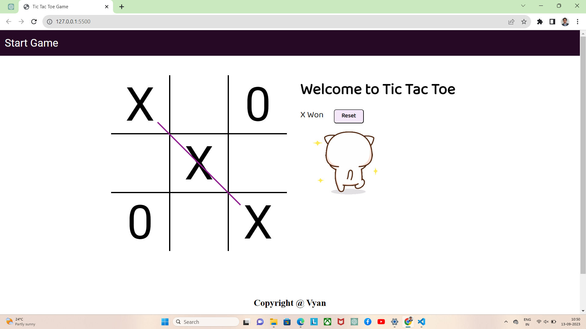

# Tic Tac Toe Game

A simple web-based Tic Tac Toe game built using HTML, CSS, and JavaScript.

## Table of Contents

- [Demo](#demo)
- [Features](#features)
- [Usage](#usage)
- [Contributing](#contributing)
- [License](#license)

## Features

- Two-player Tic Tac Toe game.
- Responsive design for various screen sizes.
- Sound effects for each move.
- Win detection and game over state.
- Reset button to start a new game.
